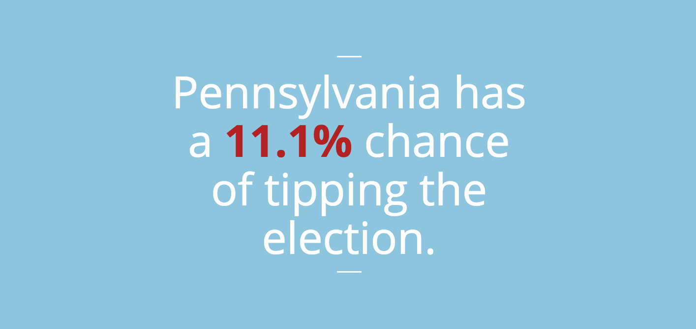

# 💻 [Make it Count!](make-it-count.herokuapp.com)

 A multi-platform tool to help inspire people to go to the polls in this historic 2016 election. This elegant tool informs and motivates Americans (especially in swing states) to learn about and participate in the electoral process. By integrating a big and beautiful web app with a Messenger chat bot that, users gain valuable insights into how much their vote counts.

[Check it out!](make-it-count.herokuapp.com)

# Preview

## 1. Enter Your Address

## 2. Find Out Crucial Information You Can Take To the Polls

## 3. Chat With the Messenger Bot

## Built With

* Sublime
* Ruby
* Rails 5.0
* Messenger Bot
* Google Civic Information API
* Google Maps API
* NY Times
* FiveThirtyEight

## Acknowledgments
Thanks to [Viking Code School](https://github.com/vikingeducation) for creating this assignment.

### Get in touch if you are having any issues!